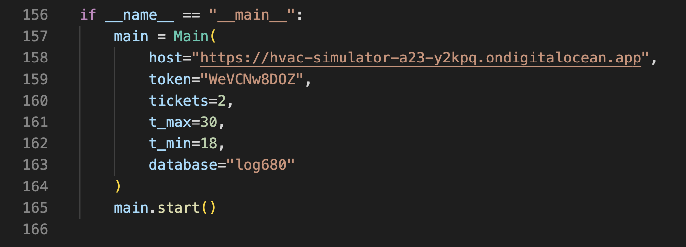
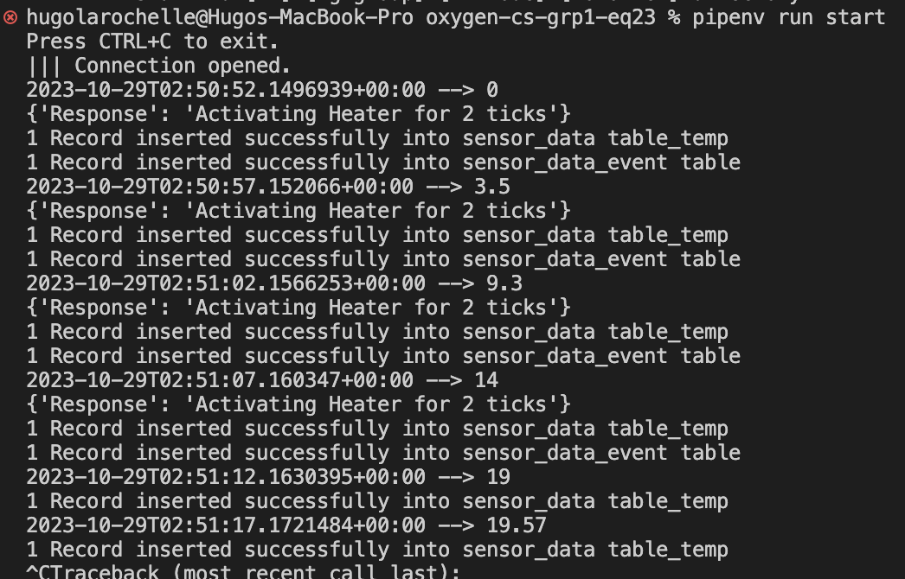
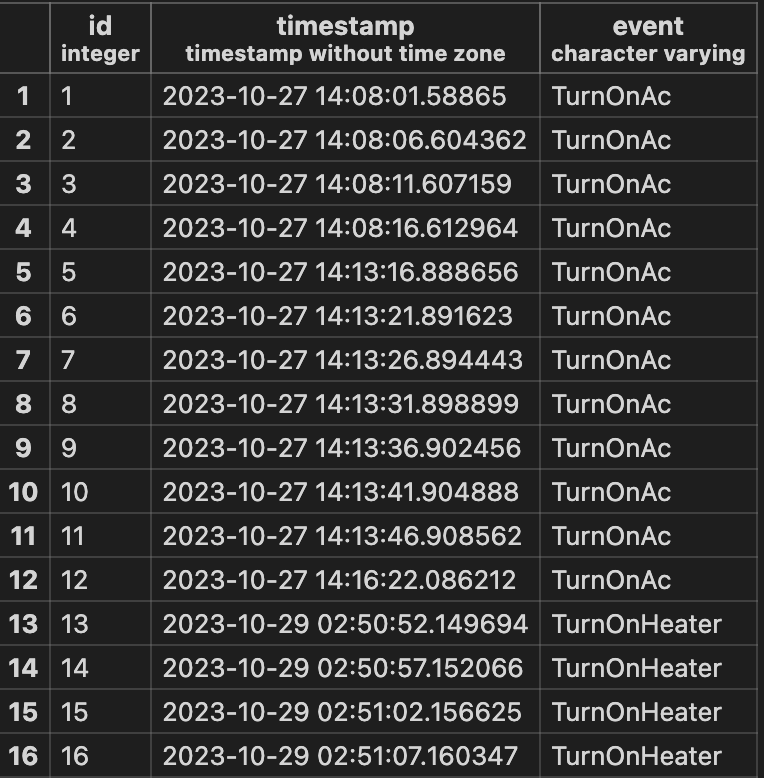
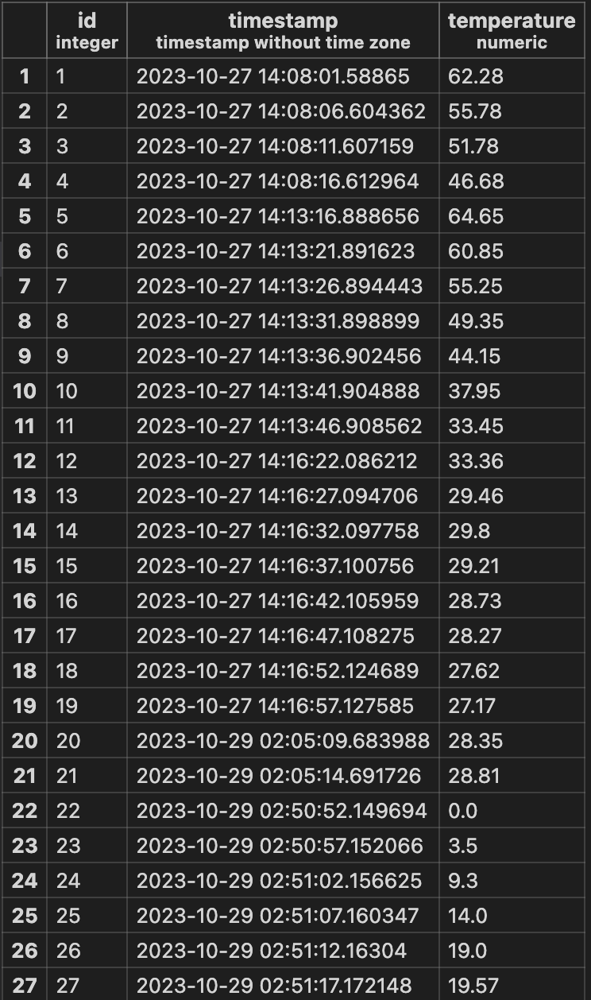

# oxygen-cs-grp1-eq23

# Table des matières 

- [Oxygen-CS](#oxygen-cs)
  - [Modification des variables du code source](#modification-des-variables-du-code-source)
  - [Ajout de la base de données du code source](#ajout-de-la-base-de-données-du-code-source)
  - [Tests et modification](#tests-et-modification)
- [Intégration continue](#intégration-continue)
  - [Création d'image Docker Metrics](#création-dimage-docker-metrics)
  - [Création d'image Docker HVAC optimisée](#création-dimage-docker-hvac-optimisée)
  - [Pipeline repository Metrics](#pipeline-repository-metrics)
  - [Pipeline repository HVAC](#pipeline-repository-hvac)
- [Métriques DevOps](#métriques-devops)
  - [Métriques CI](#métriques-ci)
 
## Oxygen-CS

### Modification des variables du code source

<p align="justify">Pour faire marcher le projet, nous avions premièrement changer les variables du code source. Ces variables étaient `"HOST"` (le url pour accéder à la simulation), `"TOKEN"` (le token donné par le chargé de laboratoire pour avoir accès aux données), `"T_MAX"` (la température maximum, en degré celsius, avant que l'air climatisé (AC) embarque), `"T_MIN"` (la température minimum, en degré celsius, avant que le chauffage embarque) et `"DATABASE"` (la base de données utilisée pour stocker les données de la simulation).</p>



<p align="justify">Nous avons décidé de choisir `30` comme température maximale et `18` comme température minimale. Ce choix a été fait en prenant compte des températures moyenne du Québec en 2023.</p>

### Ajout de la base de données du code source

Pour faire marcher la base de données, veuillez premièrement installer psycopg2 : 
```
pip install psycopg2-binary
```
<p align="justify">Pour enregistrer les données de la simulation, nous avons choisi de prendre la même base de données pour le premier laboratoire. De plus, nous avons créer 2 tables pour supporter celles-ci, pour accéder et/ou modifier les tables, se référer aux projet https://github.com/pjbeltran/metrics-grp1-eq23-a23/tree/develop dans le fichier : https://github.com/pjbeltran/metrics-grp1-eq23-a23/blob/develop/oxygen/src/bd/create-tables.ts#L17 </p>

<p align="justify">La décision de séparer les données en 2 tables a été faite afin de facilité l'affichage graphique des données lors des prochains laboratoire avec Grafana. Pour faire rouler l'application, premièrement inscrire cette commande `pipenv install` pour s'assurer d'avoir les dépendances du projet requises et `pipenv run start` pour faire marcher la simulation.</p>



<p align="justify">La première table intitulée `sensor_data_event` sert à stocker les données (date et l'événement) lorsque la température est au-dessous de `18` degré celsius ou au-dessus de `30` degrés celsius.</p>



La deuxième table intilutée `sensor_data_temp` sert à stocker **TOUTES** les données (date et température) que la simulation capte.



<p align="justify">La même démarche que dans le laboratoire 1 pour faire refaire la base de données et les tables sont nécessaire pour faire marcher l'application : https://github.com/pjbeltran/metrics-grp1-eq23-a23/tree/develop#base-de-données </p>

Prendre note que les captures d'écran pour les tables de la base de données ne correspondent pas à 100% à l'image de l'application qui marche.


### Tests et modification


## Intégration continue

### Création d'image Docker Metrics

### Création d'image Docker HVAC optimisée

### Pipeline repository Metrics

### Pipeline repository HVAC

## Métriques DevOps

### Métriques CI
